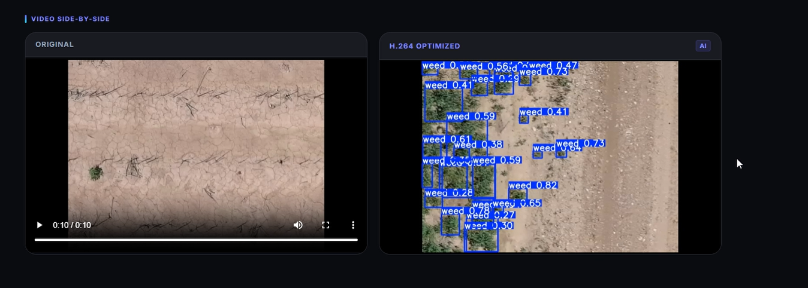

# 🌱 Cotton Weed Detection System

**AI system that detects weeds in cotton fields from drone footage — enabling targeted spraying and reducing chemical waste.**

---

## Quick Demo


> Upload a field video → Detect weeds → View results instantly

---

## Project Overview

This project is an AI-powered web application that detects weeds in cotton fields using drone or tractor footage. It processes images and videos to identify weeds among crops and highlights them visually.

By automating weed detection, the system helps:

* Reduce manual labor
* Lower herbicide usage
* Improve farming efficiency

---

## Why This Project Matters

Weed control is one of the most expensive and time-consuming challenges in agriculture. Traditional spraying methods waste chemicals and harm the environment.

This system provides a smarter approach:

* Detect weeds precisely
* Enable targeted spraying
* Support future automation (e.g., smart tractors)

---

## How It Works

**Pipeline Overview:**
Upload → Extract Frames → Detect Weeds → Annotate → Rebuild Video → Display Results

1. **Upload:** Users upload images or videos through the web interface
2. **Frame Extraction:** Videos are split into individual frames
3. **Model Inference:** YOLOv8 detects cotton plants and weeds
4. **Annotation:** Bounding boxes and confidence scores are added
5. **Video Reconstruction:** Frames are combined into an output video
6. **UI Display:** Results are shown side-by-side with the original media

---

## Visual Results

* **Before vs After Detection**

  * 

* **Live Demo**

  * 

---

## Features

* Supports both image and video inputs
* Fast processing pipeline with minimal delay
* Side-by-side comparison for easy validation
* Handles large videos using background processing
* Fully containerized with Docker
* Optimized inference using OpenVINO

---

## 📊 Model Performance

The model performs well at distinguishing cotton plants from weeds. Crop detection is more accurate due to more consistent visual patterns, while weed detection is slightly more challenging.

* **mAP@50 (Weed):** 76.0%
* **Precision (Weed):** 74.9%
* **Recall (Weed):** 66.6%
* **mAP@50 (Cotton):** 93.8%

---

## 🧱 Tech Stack

* **Frontend:** React, Vite, JavaScript, HTML, CSS
* **Backend:** Python, Flask, OpenCV
* **Machine Learning:** YOLOv8 (Ultralytics), PyTorch, OpenVINO
* **Deployment:** Docker, Docker Compose, Bash

---

## 📁 Project Structure

```text
Cotton-Weed-Prediction-Model/
 ├── backend/                 # Flask API and inference pipeline
 ├── frontend/                # React user interface
 ├── training-the-model/      # Model training notebooks and configs
 ├── utils/                   # Dataset validation and analysis tools
 ├── tools/                   # Testing and developer scripts
 ├── samples/                 # Example images and videos
 ├── docker-compose.yml       # Deployment configuration
 ├── requirements.txt         # Python dependencies
 └── model.pt                 # Trained model weights
```

---

## 🔮 Future Improvements

* Improve weed detection recall with larger datasets
* Deploy on edge devices for real-time field usage
* Add live camera streaming support
* Integrate GPS-based precision spraying

---

## 📚 Documentation

* **[DEPLOYMENT.md](./DEPLOYMENT.md)** — Setup and deployment instructions
* **deployment_onboarding_guide.md** — Beginner-friendly overview
* **technology_deep_dive.md** — Detailed system explanation
* **package_requirements_doc.md** — Dependency breakdown

---

## 🧠 Final Note

This project demonstrates a full end-to-end AI system — from data processing and model training to deployment and user interface — focused on solving a real-world agricultural problem.
